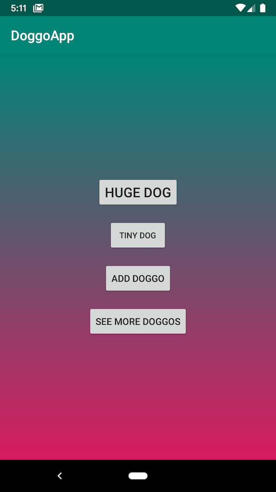
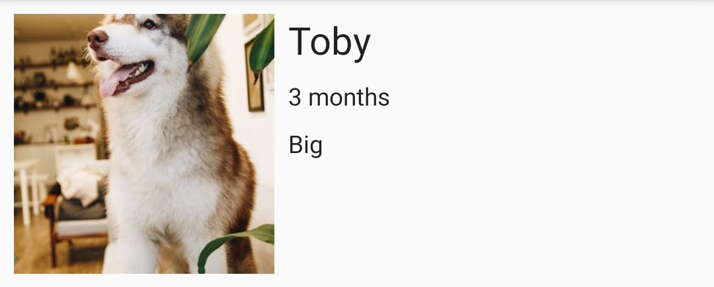
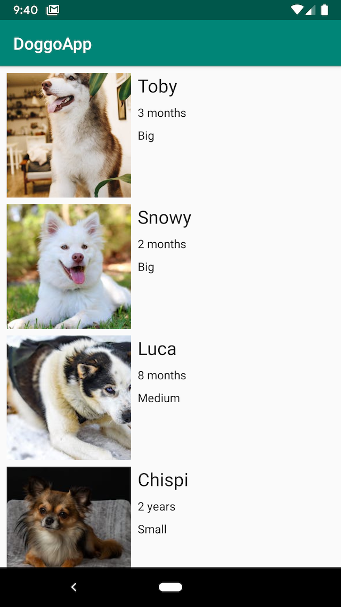
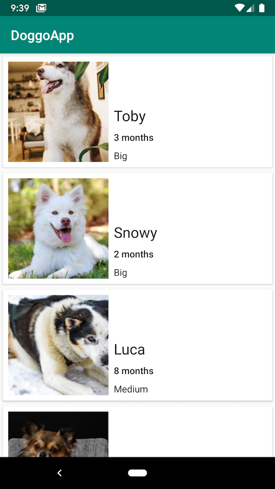
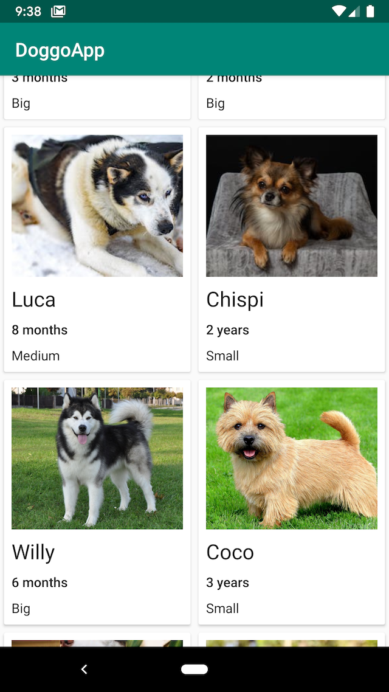
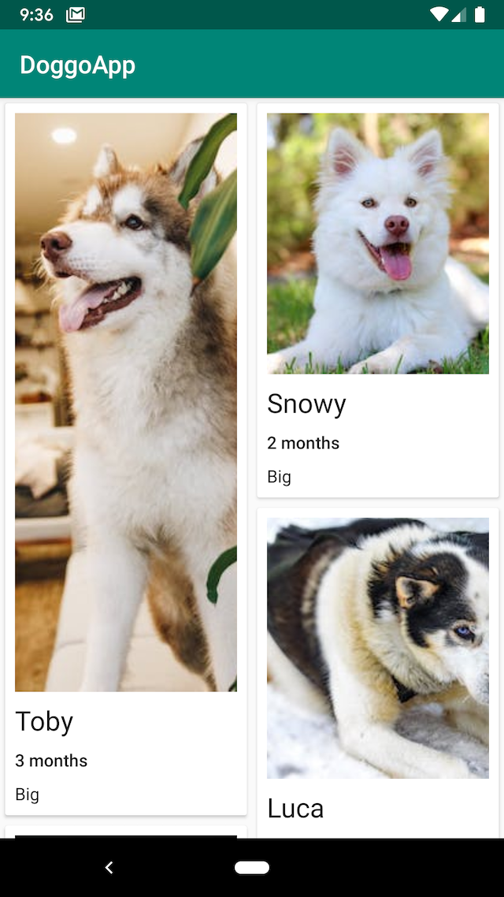

# Day 3 - Displaying Collections: RecyclerView

Learn the basics of Android and Kotlin programming, and take the first step on your journey to becoming an Android developer! This course is designed for students who are new to programming, and want to learn how to build Android apps. 

By the end of this course, you will have learned how to build an app’s layout and then practiced those skills by making a form to collect user input.

During this third workshop we will follow [this codelab](http://xariti.pandiandcode.com/codelabs/wwcbcn-android-recycler-view/#0).

## RecyclerView
Basic presentation with examples of Layouts, RecyclerView and LayoutManagers [here](https://docs.google.com/presentation/d/1XBFih4uRmscfadhR5d-mVG-ioaOhR9SegWAW4Z30OSI/edit?usp=sharing). Learn more about RecyclerView from the [documentation](https://developer.android.com/reference/androidx/recyclerview/widget/RecyclerView).

## What you'll learn

- How to use the [RecyclerView](https://developer.android.com/reference/androidx/recyclerview/widget/RecyclerView) class to display items in a scrollable list.
- How to dynamically add items to the RecyclerView as they become visible through scrolling.
- How to perform an action when the user taps a specific item.
- How to show a FAB and perform an action when the user taps it.

## What you must know already

This codelab is written for programmers and assumes you know either Java or Kotlin. If you are an experienced programmer and you are adept at reading code, you will likely be able to follow this codelab even if you don't have much experience with Kotlin.

If you do not know any Kotlin, check this [Kotlin Basic Syntax](https://kotlinlang.org/docs/reference/basic-syntax.html) link it will teach you what you need to know to move forward with the workshop. 

If you missed the past day check out [Day 1](https://github.com/WomenWhoCode/AndroidWorkshops_BCN/blob/master/Day%201%20-%20Kotlin%20Basics/README.md) and [Day 2](https://github.com/WomenWhoCode/AndroidWorkshops_BCN/blob/master/Day%202%20-%20Android%20Basics/README.md). 

To work through this codelab, you will need a computer that can run Android Studio (or already has Android Studio installed). Install Android Studio following [these instructions](https://github.com/WomenWhoCode/AndroidWorkshops_BCN/blob/master/Installation.md).

## Homework
You can continue working in your homework app or use [the solution from day 2](https://github.com/WomenWhoCode/AndroidWorkshops_BCN/blob/master/Day%201%20-%20Kotlin%20Basics/DoggoApp). We recommend you use your own problem, but not hesitate to check our solution.

### Exercise 1
We want to show in our app a list of cute doggos :dog:. 
First let's add a new button to our `MainActivity.kt` like this:



Feel free to use a different design for your main Activity.

We want to open a new Activity to list our cute dogs :dog: when the new button is tapped. You will need to create a new Activity `DoggosActivity.kt` and its layout file `activity_doggos.xml`. Don't forget to include this new Activity in your `AndroidManifest.xml`

Once you have your new Activity created, you can start editing your `activity_doggos.xml` and add your [RecyclerView](https://developer.android.com/reference/androidx/recyclerview/widget/RecyclerView). Don't forget you will need first to include the RecyclerView dependency to your `app/build.gradle` file:

```
dependencies {
    ...
    implementation 'androidx.recyclerview:recyclerview:1.0.0'
}
``` 
Add the [LinearLayoutManager](https://developer.android.com/reference/androidx/recyclerview/widget/LinearLayoutManager) to your RecyclerView

```
<androidx.recyclerview.widget.RecyclerView
            android:id="@+id/recycler_view"
            android:clipToPadding="false"
            android:layout_width="match_parent"
            android:layout_height="match_parent"
            app:layoutManager="androidx.recyclerview.widget.LinearLayoutManager"/>
``` 

Before start implementing your RecyclerView.Adapter you should create a [data class](https://kotlinlang.org/docs/reference/data-classes.html) `Doggo.kt` which will hold our dogs data to be displayed in our list. You can create this class in a new file called `Doggo.kt`

```
data class Doggo(val name: String, 
                 val age: String, 
                 val size: String, 
                 val image: Int)
```

Once we have our class `Doggo`, let's create in our `DoggosActivity.kt` a list of dogs which will be displayed in the RecyclerView. For the images we will get it from the resources, for instances, we already have `tiny_dog_norfolk.jpg` in our `res` file, we can access this using `R.drawable.tiny_dog_norfolk` which is an `Int`. You can use your own images, or you can import the ones included in this folder: [doggos_images](./doggos_images). To import the images remember that you can just copy these images into the `drawable` file, or drag and drop.
You can use this values for your list of dogs:
```
private fun doggoList() = listOf(
        Doggo("Toby", "3 months", "Big", R.drawable.doggo_1),
        Doggo("Snowy", "2 months", "Big", R.drawable.doggo_2),
        Doggo("Luca", "8 months", "Medium", R.drawable.doggo_3),
        Doggo("Chispi", "2 years", "Small", R.drawable.doggo_4),
        Doggo("Willy", "6 months", "Big", R.drawable.huge_dog_malamute),
        Doggo("Coco", "3 years", "Small", R.drawable.tiny_dog_norfolk),
        Doggo("Balto", "3 months", "Big", R.drawable.doggo_1),
        Doggo("Boby", "2 months", "Big", R.drawable.doggo_2)
    )
```

Now that we have our `Doggo.kt` data class and our list of dogs in `DoggosActivity.kt` we can create our Adapter which will be in charge of display the data into the RecyclerView.
Let's create a new file called `DoggosAdapter.kt`. This new file will contain our `DoggosAdapter` and `DoggoViewHolder`, the adapter will use the `DoggoViewHolder` to contain the view of each item(:dog:). 
Create also `layout_doggo_item.xml` which will be used to inflate each view for the item(:dog:). You should display an image, the name, the age and the size of the dog in `layout_doggo_item.xml` layout.



Our Adapter should be able to receive as a parameter a list of dogs.
The signature of our Adapter should look like this:
```
class DoggosAdapter(val doggos: List<Doggo>) : RecyclerView.Adapter<DoggoViewHolder>()
```
Implement the three methods: `onCreateViewHolder`, `getItemCount`
and `onBindViewHolder`

Once you have implemented your Adapter, you should asign your new adapter to your RecyclerView. You should do that in `DoggosActivity.kt`.

The result should be something like this:



### Exercise 2
You can make the appearance of your list more fancy using [CardViews](https://developer.android.com/reference/androidx/cardview/widget/CardView) in your proyect. You can follow the documentation and try to get a similar result:



### Exercise 3
We have used [LinearLayoutManager](https://developer.android.com/reference/androidx/recyclerview/widget/LinearLayoutManager) to display our dogs, you can use a diferent LayoutManager of your choice:
* [GridLayoutManager](https://developer.android.com/reference/androidx/recyclerview/widget/GridLayoutManager?hl=en)



* [StaggeredGridLayoutManager](https://developer.android.com/reference/androidx/recyclerview/widget/StaggeredGridLayoutManager?hl=en)



